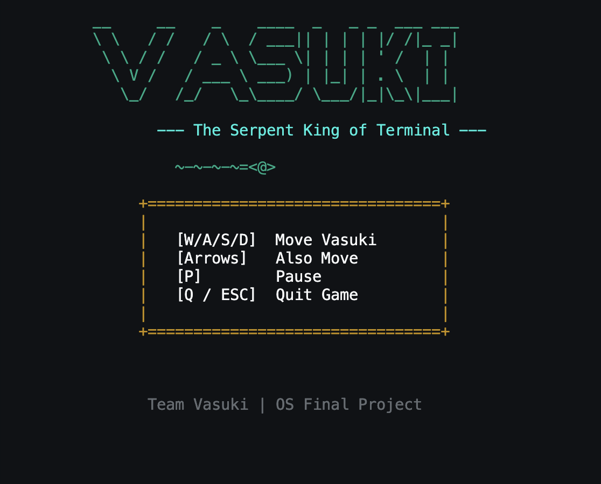
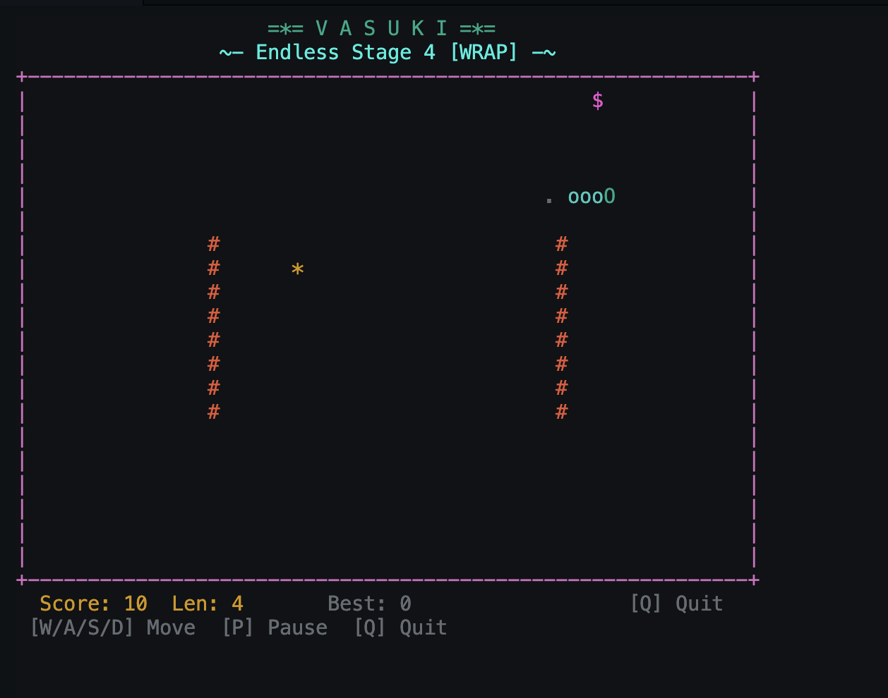
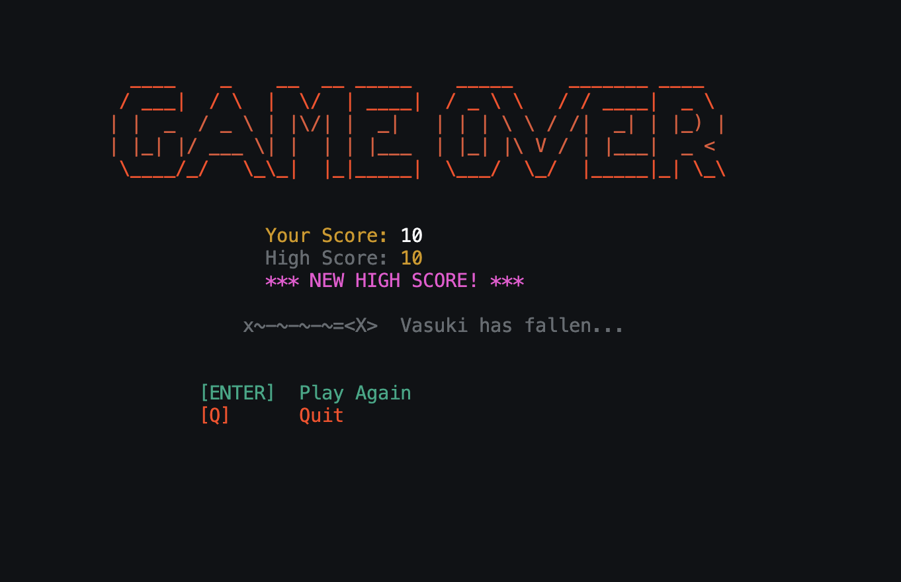
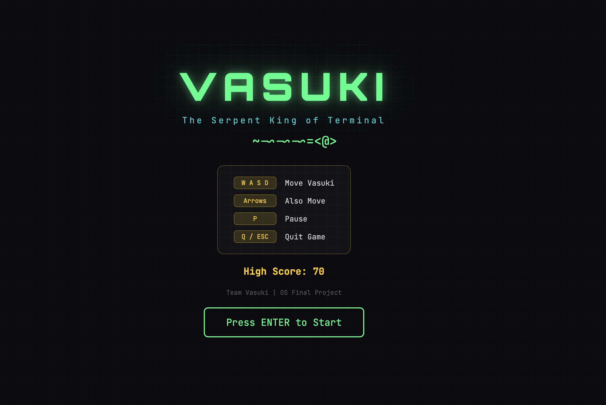
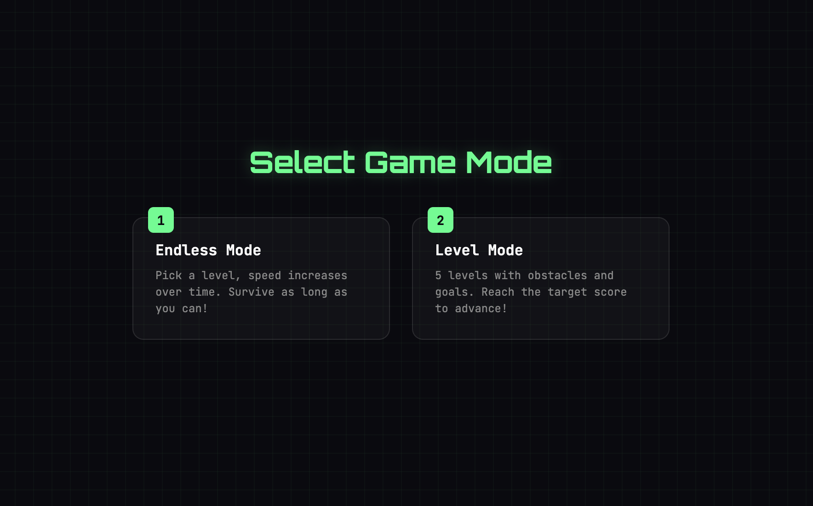
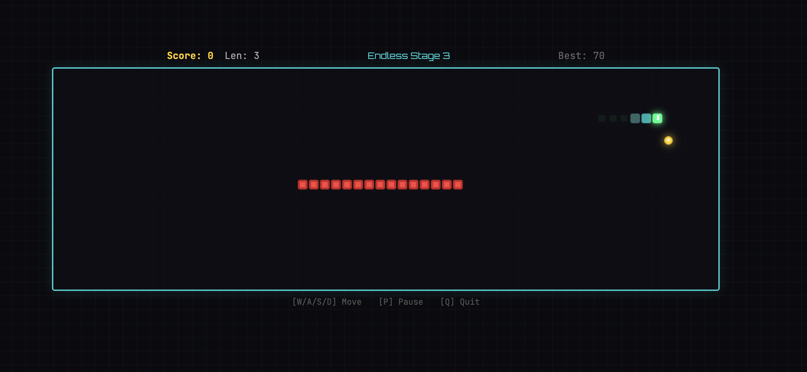
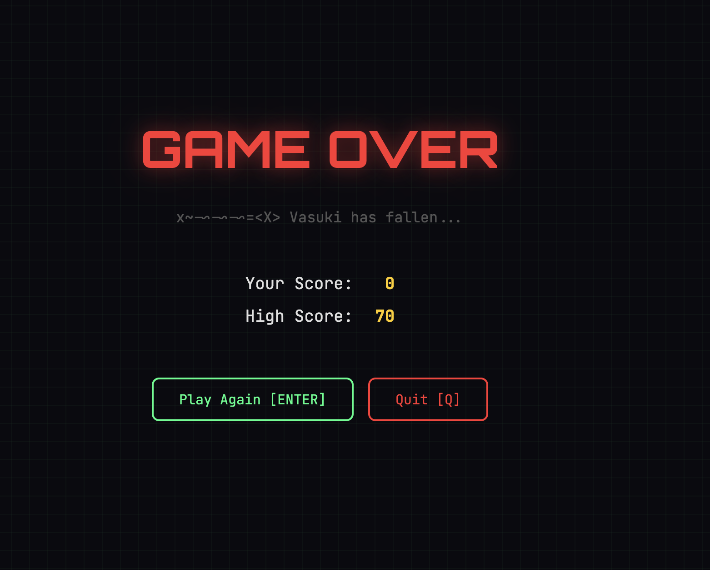

# Vasuki - The Serpent King of Terminal

A real-time Snake game built entirely in C from scratch, using **custom-written libraries** — no `<string.h>`, `<math.h>`, or default `malloc()`/`free()`. Playable in the terminal and in the browser via WebAssembly.

---

## Screenshots

### Terminal

| Welcome Screen | Gameplay | Game Over |
|:-:|:-:|:-:|
|  |  |  |

### Web (WebAssembly)

| Welcome Screen | Mode Selection |
|:-:|:-:|
|  |  |

| Gameplay | Game Over |
|:-:|:-:|
|  |  |

---

## Team

| Name             | Enrollment No. |
|------------------|----------------|
| Raman Luhach     | 230107         |
| Rachit Kumar     | 230128         |
| Harshal Nerpagar | 230076         |

---

## Prerequisites

| Requirement | Terminal Build | Web (WASM) Build |
|-------------|:-:|:-:|
| C99 Compiler (GCC / Clang) | Required | - |
| [Emscripten SDK](https://emscripten.org/docs/getting_started/) | - | Required |
| Python 3 (for local server) | - | Optional |
| macOS / Linux (POSIX) | Required | - |
| Modern browser with WASM support | - | Required |

> **Note:** The terminal build uses `afplay` (macOS built-in) for sound. On Linux, swap `afplay` for `aplay` in `audio/audio.c`.

---

## Build and Run

```bash
make          # Build terminal game
make run      # Build and run
make wasm     # Build web frontend (requires Emscripten)
make serve    # Build WASM and start local server on port 8080
make clean    # Remove build artifacts
```

**Compiler flags:** `-Wall -Wextra -Werror -std=c99 -g`

---

## Controls

| Key | Action |
|-----|--------|
| `W/A/S/D` or Arrow Keys | Move |
| `P` | Pause |
| `Q` / `ESC` | Quit |
| `ENTER` | Play Again (on Game Over) |

---

## Game Modes

### Endless Mode
Pick a starting stage and survive as long as possible. Speed increases every 50 points. No level progression — just pure survival.

### Level Mode
Progress through 5 structured levels, each with a target score and unique layout:

| Level | Target Score | Speed | Layout | Wrap |
|-------|:-:|:-:|--------|:-:|
| 1 | 30 | 100 ms | Open field | Yes |
| 2 | 80 | 90 ms | Walled boundaries | No |
| 3 | 150 | 80 ms | Horizontal wall at mid-screen | No |
| 4 | 240 | 70 ms | Two vertical walls | Yes |
| 5 | 350 | 60 ms | Box obstacle in center | No |

---

## Scoring and Combo System

| Food Type | Symbol | Points | Behaviour |
|-----------|:-:|:-:|-----------|
| Normal | `*` | 10 | Always active, respawns instantly |
| Bonus | `$` | 50 | Spawns every ~100 ticks, expires after 5s (flashes in last 2s) |

**Combo multiplier:** Eating food within a **3-second window** builds a combo chain. The multiplier scales up to **5x**, so a well-timed bonus food can yield up to **250 points** in a single pickup.

**Speed progression:** Every 50 points earned, the frame delay drops by 5 ms (starting at 100 ms, capped at 40 ms). Vertical movement is intentionally 1.4x slower than horizontal for visual balance.

---

## Architecture

```
vasuki/
├── config/       Config constants (scoring, speed, levels)
├── math/         Bit manipulation arithmetic (shift-and-add, binary long division)
├── string/       String manipulation (no string.h)
├── memory/       Custom allocator (64KB pool, first-fit, coalescing)
├── screen/       Terminal rendering (ANSI escape codes)
├── keyboard/     Non-blocking input (POSIX termios, raw mode)
├── timer/        System clock (gettimeofday)
├── random/       PRNG seeded from /dev/urandom (xorshift32)
├── fileio/       Raw file I/O (open/read/write/close syscalls)
├── audio/        Non-blocking sound (fork + exec)
├── game/         Game logic + main entry point
├── sounds/       Sound assets (.wav)
└── frontend/     Web frontend (C → WASM via Emscripten)
```

---

## Custom Libraries — Technical Details

### Memory Allocator (`memory/`)
A 64 KB static memory pool managed with a first-fit linked-list allocator.

- Each allocation carries a `BlockHeader` (size, free flag, next pointer).
- **Splitting:** If leftover space exceeds the minimum threshold (header + 16 bytes), the block is split to reduce waste.
- **Coalescing:** Adjacent free blocks are merged on `free()` to combat fragmentation.
- Bounds-checked — invalid pointers are rejected.

### Math Library (`math/`)
All arithmetic is implemented without hardware multiply/divide instructions:

- **Multiplication:** Shift-and-add algorithm — for each set bit in the multiplier, the multiplicand is shifted and accumulated.
- **Division:** Binary long division — iteratively subtracts the divisor shifted to the highest fitting bit position.
- **Modulo:** Computed as `a - (a/b) * b` using the custom divide.
- **Absolute value:** Branchless via sign-bit masking: `(value ^ mask) - mask`.

### Random (`random/`)
- **Seed:** 4 bytes read from `/dev/urandom` (kernel entropy pool).
- **Algorithm:** xorshift32 — three XOR-shift operations per step, passes standard statistical tests.
- Provides `random_range(max)` and `random_between(min, max)`.

### String Library (`string/`)
Drop-in replacements for standard string functions: `str_length`, `str_compare`, `str_copy`, `str_concat`, `str_find_char`, `str_split`, plus `int_to_string` and `string_to_int` converters.

### File I/O (`fileio/`)
Wraps raw `open`/`read`/`write`/`close` syscalls for high-score persistence — no `<stdio.h>`.

### Audio (`audio/`)
- **Terminal:** `fork()` creates a child process that calls `execlp("afplay", ...)`. Parent returns immediately for non-blocking playback. Zombie processes are reaped via `waitpid` with `WNOHANG`.
- **Web:** Synthesized using the Web Audio API — oscillator nodes generate square, sine, and sawtooth waveforms for eat, bonus, die, and level-up sounds.

### Keyboard (`keyboard/`)
Switches the terminal into raw mode using POSIX `termios` — disables canonical input, echo, and signal processing so keypresses are read one-at-a-time without blocking the game loop.

### Timer (`timer/`)
Wraps `gettimeofday()` for millisecond-precision timestamps, elapsed time checks, and `usleep()`-based delays.

---

## WebAssembly Bridge

The C game logic is compiled to WebAssembly via Emscripten. A bridge layer (`frontend/wasm/wasm_bridge.c`) exports **70+ functions** using `EMSCRIPTEN_KEEPALIVE`, providing a complete C-to-JavaScript API.

**How it works:**
1. `emcc` compiles all C sources into a single WASM module (`frontend/vasuki.js`).
2. JavaScript loads the module via `VasukiModule()` and calls exported `_wasm_*` functions.
3. All game state lives in C/WASM memory — JS only handles rendering and input.

**Platform shims for the browser:**

| Module | Native (Terminal) | WASM (Browser) |
|--------|-------------------|----------------|
| Timer | `gettimeofday()` | `emscripten_get_now()` |
| Random | `/dev/urandom` | `emscripten_random()` |
| Audio | `fork()` + `afplay` | Web Audio API oscillators |
| Screen | ANSI escape codes | Canvas 2D (960x320, 16px cells) |
| Keyboard | `termios` raw mode | JS `keydown` events |

**Rendering:** The web frontend draws on an HTML5 Canvas — gradient snake body with glowing head, pulsing food, blinking bonus pickups, red obstacle blocks, and a subtle grid overlay.

---

## OS Concepts Demonstrated

| Library | OS Concept |
|---------|-----------|
| `memory.c` | Heap management, first-fit allocation, block splitting, coalescing, fragmentation |
| `keyboard.c` | Terminal I/O modes, raw mode, file descriptors, POSIX termios |
| `timer.c` | System clocks, `gettimeofday` syscall, microsecond-precision timing |
| `random.c` | `/dev/urandom` device file, kernel entropy, PRNG seeding |
| `fileio.c` | File descriptors, `open`/`read`/`write`/`close` syscalls |
| `audio.c` | Process creation (`fork`), `exec` family, zombie reaping (`waitpid`) |
| `math.c` | Bit manipulation, shift-and-add multiplication, binary long division |
| `wasm_bridge.c` | Cross-compilation, ABI boundaries, platform abstraction |
